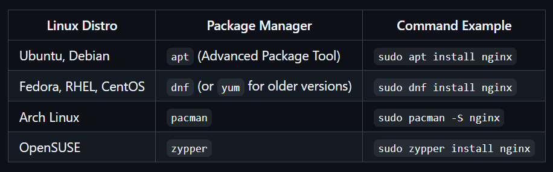

## Why Linux? 

- Free and OpenSoure
- Low Maintenace Costs
- Better Resource Utilization
- High Scalability
- Less Vulnerable
- Frequent and Transparent Updates
- High Scalability

## Linux Structure

## In Short 

- Hardware is the base.
- Kernel controls everything.
- Libraries/utilities support apps.
- Shell helps you give commands.
- User apps are what you use daily.

## Linux Distributions

- Linux distributions (distros) are different versions of Linux that package the Linux kernel with various software, system utilities, and package managers. Each distro is designed for different use cases, such as personal computing, server management, or security.

* Ubuntu 
* CentOS 
* Debian 
* Fedora 
* Arch Linux
* Kali Linux

## What is Package manager?

- A package manager is a tool that automates the process of installing, updating, configuring, and removing software in a Linux system. It ensures that software and its dependencies are managed efficiently.

## How does it work? 

- A package manager fetches software from official repositories (online storage of packages).
- When you install software, the package manager:  Downloads the package from the repository. Resolves dependencies (installs additional required software). Installs and configures the software automatically.
- A single command updates all installed packages to the latest version.
- The package manager also removes software cleanly without leaving unnecessary files.

## Different Package Managers: 

- Package managers save time and reduce errors
- They’re essential for DevOps, developers, and sysadmins
- Almost every OS and language has its own package manager

## Useful commands 
Check if package is installed 

 ``which <package-name> or 
 <package-name> --version``

Search for a package
`apt search <package-name>`

Install a package
`sudo apt install <package-name>`

Update all packages
`sudo apt update && sudo apt upgrade`

Remove/uninstall a package
`sudo apt remove <package-name>`

List All Installed Packages
`apt list --installed`

show info about a package 
`apt show <package-name>`

